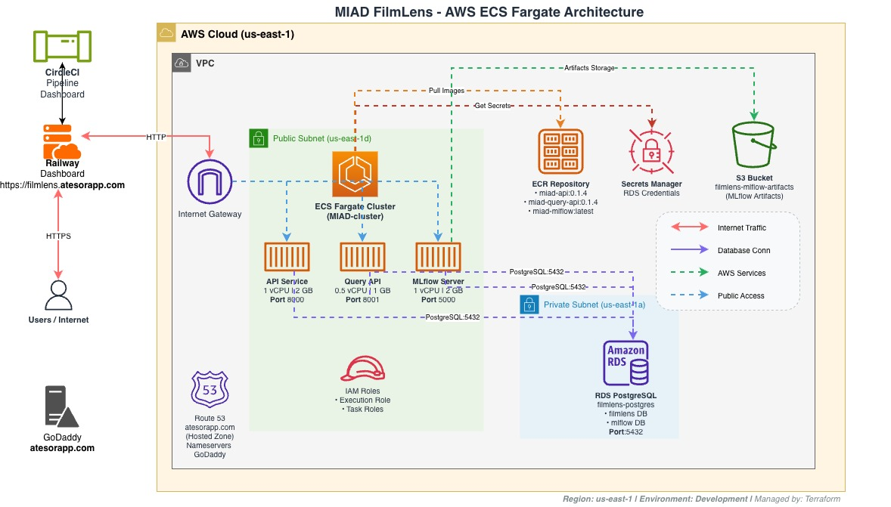

# MIAD FilmLens - Infraestructura en AWS

Este repositorio contiene toda la infraestructura necesaria para desplegar el sistema FilmLens en Amazon Web Services (AWS).

## ¿Qué es FilmLens?

FilmLens es un sistema de clasificación y análisis de películas que utiliza Machine Learning para detectar contenido sensible. La aplicación está compuesta por tres servicios principales que trabajan juntos para ofrecer predicciones y análisis de datos.

## Arquitectura del Sistema

### Componentes:
- **Clúster**: Componente de configuración principal para deplegar el ECS Fargate con sus services y tasks.
- **Internet-config**: Componente de configuración para configurar los dominios de Atesorapp con Filmlens y también ACM certificados
- **MlFlow-storage**: Componente para definir la persitencia en S3 de los modelos.
- **storage**: Componente para definir los recursos como bases de datos y storage en la nube de la solución de filmlens




Nuestra infraestructura está construida sobre AWS y consta de:

- **API Service**: El servicio principal que procesa las predicciones de ML
- **Query API**: Servicio especializado en consultas rápidas a la base de datos
- **MLflow Server**: Plataforma para rastrear experimentos y gestionar modelos de ML
- **Base de Datos PostgreSQL**: Almacena todos los datos del sistema
- **S3 Bucket**: Guarda los artefactos de los modelos de ML

Todos los servicios corren en contenedores Docker sobre AWS ECS Fargate, lo que significa que no tenemos que preocuparnos por administrar servidores.

## Requisitos Previos

Antes de empezar, necesitas tener instalado en tu computadora:

1. **Terraform** (versión 1.11 o superior)
   - Para instalar: https://developer.hashicorp.com/terraform/downloads

2. **AWS CLI** (configurado con tus credenciales)
   - Para instalar: https://aws.amazon.com/cli/
   - Después de instalar, ejecuta: `aws configure`

3. **Acceso a la cuenta de AWS** con los permisos necesarios

## Configuración Inicial

### 1. Clonar el repositorio

```bash
git clone https://github.com/codebusters-MIAD/dsa-project-t1-infra.git
cd dsa-project-t1-infra
```

### 2. Entender la estructura del proyecto

Si se desea crear un nuevo componente se debe usar un enfoque de modulos, que permita la reutilizacion, esto es una
buena practica en Terraform, y luego en la carpeta componentes, se debe crear la carpeta nueva junto con los llamados
al modulo.

```
infrastructure/
├── components/
│   ├── cluster/           # Configuración del cluster ECS y servicios
│   ├── storage/           # Configuración del bucket S3
│   └── mlflow-storage/    # Configuración de almacenamiento para MLflow S#
└── shared/                # Módulos reutilizables para cualquier componente de negocio
    ├── ecs/               
    ├── iam/               
    ├── rds/               
    ├── s3/                
    └── security-groups/   
```

### 3. Configurar las variables

El archivo más importante es `infrastructure/components/cluster/terraform.tfvars`. Aquí defines:

- Las imágenes de Docker que vas a desplegar
- Las credenciales de la base de datos
- La configuración de cada servicio

**Nota**: Este archivo contiene información sensible, nunca lo subas a GitHub.

### 4. Desplegar la infraestructura

```bash
cd infrastructure/components/cluster
terraform init
# Revisa lo que se va a crear
terraform plan
# Confirma con 'yes' para crear todo    
terraform apply   
```

El proceso toma aproximadamente 5-10 minutos. Al finalizar, verás las IPs públicas de cada servicio.

## Accediendo a los Servicios

Una vez desplegado, puedes acceder a:

- **API**: `http://<IP-PUBLICA-API>:8000/docs` - Documentación interactiva de la API
- **Query API**: `http://<IP-PUBLICA-QUERY>:8001/health` - Estado del servicio de consultas  
- **MLflow**: `http://<IP-PUBLICA-MLFLOW>:5000` - Dashboard de experimentos ML

Para obtener las IPs actuales:

```bash
aws ecs list-tasks --cluster MIAD-cluster --query 'taskArns[]' --output text | \
xargs -I {} aws ecs describe-tasks --cluster MIAD-cluster --tasks {} \
--query 'tasks[].attachments[].details[?name==`networkInterfaceId`].value' --output text | \
xargs -I {} aws ec2 describe-network-interfaces --network-interface-ids {} \
--query 'NetworkInterfaces[].Association.PublicIp' --output text
```

## Mantenimiento Común

### Ver logs de un servicio

```bash
# API logs
aws logs tail /ecs/MIAD/api --follow

# Query API logs  
aws logs tail /ecs/MIAD/query-api --follow

# MLflow logs
aws logs tail /ecs/MIAD/mlflow --follow
```

### Pausar un servicio (para ahorrar costos)

Si necesitas detener temporalmente un servicio sin borrarlo:

```bash
aws ecs update-service --cluster MIAD-cluster --service api --desired-count 0
```

Para volver a iniciarlo:

```bash
aws ecs update-service --cluster MIAD-cluster --service api --desired-count 1
```

### Actualizar una imagen de Docker

Las imagenes de Docker son versionadas en el otro repositorio, dado que la creación depende del código fuente.

1. Sube la nueva imagen a ECR
2. Modifica el tag en `terraform.tfvars`
3. Ejecuta `terraform apply`

### Ver el estado de los servicios

```bash
aws ecs describe-services --cluster MIAD-cluster --services api query-api mlflow \
--query 'services[].[serviceName, status, desiredCount, runningCount]' --output table
```

## Solución de Problemas Comunes

### Un servicio no arranca

1. Verifica los logs: `aws logs tail /ecs/MIAD/<nombre-servicio> --follow`
2. Revisa que las credenciales de la base de datos sean correctas
3. Confirma que los Security Groups permitan el tráfico necesario

### No puedo acceder a la base de datos

Los servicios están en subnets públicas, pero la base de datos está en subnets privadas. Solo los servicios del cluster pueden acceder a ella por seguridad.

### La IP cambió después de reiniciar

Las IPs públicas cambian cuando un servicio se reinicia. Para IPs fijas, considera implementar un Application Load Balancer (ALB) o usar Route 53.


**Proyecto MIAD - Storytelling con Datos**  
Universidad de los Andes | 2025

**Estudiantes**  
- Margarita Bain
- Rodolfo Moreno
- Keisy Gonzalez
- William Pinilla

**Fase 2 - Implementaciones** 
- Automatizar la extraccion de datos de TMDB
- Mejorar el proceso de MLops que se tiene
- Creacion de pipelines de datos a traves de una herramienta
